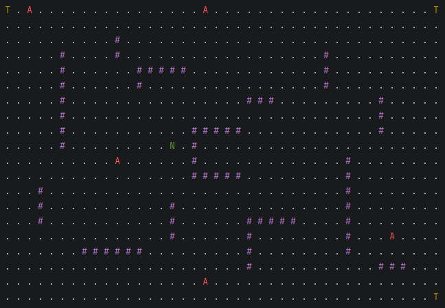

# Matrix Chase Simulation

This project is a Java console-based simulation where different entities move inside a matrix-like environment. The main character, Neo, tries to reach one of the available telephones while several agents move through the board trying to catch him.

The matrix contains different types of entities:

- **Neo**: the character that tries to reach a telephone.
- **Agents**: enemies that chase Neo.
- **Telephones**: target positions Neo must reach to win.
- **Obstacles**: blocked cells that cannot be crossed.

Each moving entity runs in its own thread, which means Neo and the agents act independently and may move at different times depending on their speed. The simulation is rendered in the console and updates periodically until Neo reaches a telephone or an agent catches him.

The movement logic uses pathfinding to calculate the best route through the matrix. Neo also takes into account danger zones generated by the agents, so he can try to avoid risky areas instead of only choosing the shortest path.

## Main Features

- Console-based matrix rendering.
- Multithreaded movement for Neo and agents.
- Obstacles and target positions.
- Pathfinding-based movement.
- Dynamic danger zones created by agents.
- Colored console output for better visualization.



## How to Compile and Run

From the root folder of the project, compile all Java files into the `bin` directory:

```bash
javac -d bin src/*.java
```

Then run the program using the Main class:


```bash
java -cp bin Main
```
## Technologies Used

- Java
- Threads
- CountDownLatch
- Pathfinding with weighted movement
- ANSI console colors

## Goal of the Simulation

The objective is to model a simple concurrent chase scenario where autonomous entities interact inside a shared matrix. Neo must find a safe path to a telephone while avoiding agents that move independently across the board.